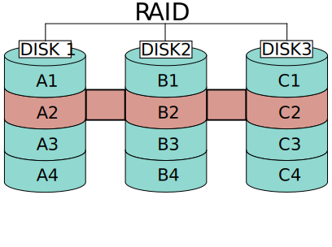
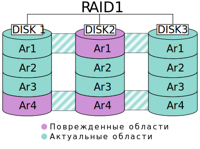
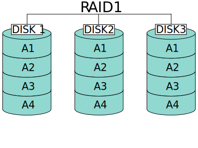
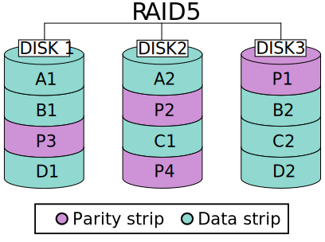
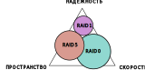
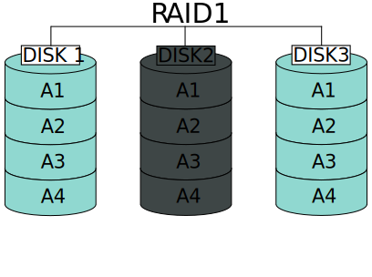
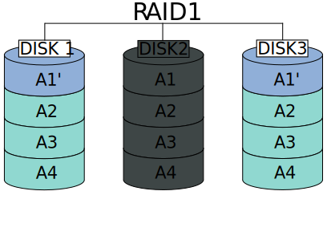
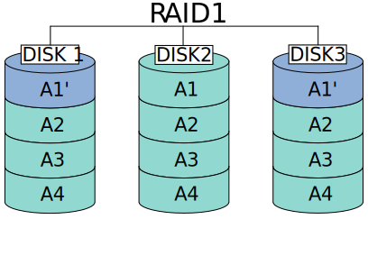
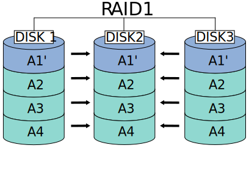

# storage-svg

Images are under [CC BY-SA 4.0](https://creativecommons.org/licenses/by-sa/4.0/)

## BLK common

[common/bio_vec.svg](common/bio_vec.svg)

[common/block-int.svg](common/block-int.svg)

## RAID images

[raid/RAID.svg](raid/RAID.svg)

[raid/RAID1_broken.svg](raid/RAID1_broken.svg)

[raid/RAID1_raw.svg](raid/RAID1_raw.svg)

[raid/RAID5_raw.svg](raid/RAID5_raw.svg)

[raid/raid_class.svg](raid/raid_class.svg)

[raid/rebuild_raid1/rebuild_1.svg](raid/rebuild_raid1/rebuild_1.svg)

[raid/rebuild_raid1/rebuild_2.svg](raid/rebuild_raid1/rebuild_2.svg)

[raid/rebuild_raid1/rebuild_3.svg](raid/rebuild_raid1/rebuild_3.svg)

[raid/rebuild_raid1/rebuild_5.svg](raid/rebuild_raid1/rebuild_5.svg)

## Compression images

[compression/lz4_algo.svg](compression/lz4_algo.svg)

[compression/lz4_bformat.svg](compression/lz4_bformat.svg)

[compression/lz4_comp.svg](compression/lz4_comp.svg)

[compression/vdo_compression_h.svg](compression/vdo_compression_h.svg)

[compression/vdo_compression_v.svg](compression/vdo_compression_v.svg)

[compression/zfs_compression.svg](compression/zfs_compression.svg)

[compression/compression_problems/block_size_problem.svg](compression/compression_problems/block_size_problem.svg)

[compression/compression_problems/comp_size_problem.svg](compression/compression_problems/comp_size_problem.svg)

## Log-structured images
[log-structured/log.svg](log-structured/log.svg)

[log-structured/indirect-log.svg](log-structured/indirect-log.svg)

